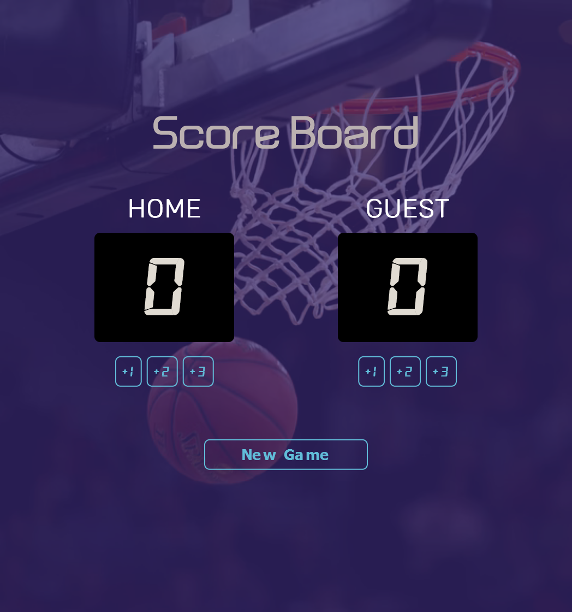

# BasketBall Score Board🏀
A simple web interface that was made to keep track of scores between two teams.

Each team has three increment button actions to increase the score of the team.

This project is a part of [Scrimba-Learn JavaScript](https://scrimba.com/learn/learnjavascript) course

## 🛠 Skills
Javascript, HTML, CSS...

## Screenshots

## Demo

Demo Link: [https://thepran.github.io/basketball-scoreboard](https://thepran.github.io/basketball-scoreboard/)

## Feedback

If you have any feedback, please reach out to us at negipranaysingh@gmail.com

